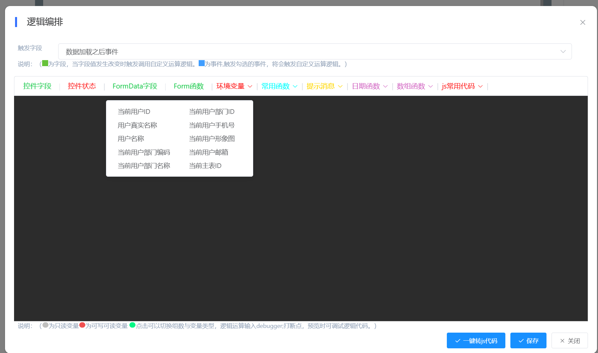

<div align="center"><h1>简搭云可视化表单设计</h1></div>
<div align="center"><h3>有可能是扩展性最好的表单设计器之一</h3></div>

<div align="center">

[](https://gitee.com/liuyaping007/vuefrom1.1.0/stargazers)
[](https://gitee.com/liuyaping007/vuefrom1.1.0/members)
[](https://gitee.com/dotnetchina/Furion/blob/master/LICENSE)

</div>

**简搭云可视化表单平台**是一款创新型的无码在线开发平台，旨在为企业和开发者提供高效、灵活的应用构建解决方案。该平台以可视化表单设计为核心，用户通过简单的拖拽操作即可快速构建复杂的企业级应用系统，实现“所见即所得”的开发体验。全程支持热部署，无需繁琐的编译过程的无码平台，极大地提升了开发效率和系统上线速度。

### 核心功能模块

- **表单应用模块**  
  - 提供灵活的表单设计能力，支持多种组件和布局方式，满足不同场景的需求。

  - 设计完成系统将自动生成在线Mybatis语法增、删、改、查、列表查询、批量修改、批量删除、统计分析接口，表单前端vue源码，实现CRUD操作零SQL开发。

  - 同时生成对应的列表页面功能，统计分析页面。  

- **流程平台**  
  - 可视化流程设计引擎，支持复杂的业务流程自动化，提升企业运营效率。支持并行会签，串行会签，百分比审批，跳转，发起沟通，废弃，驳回，审批，打印，抄送，非连续自动跳过，连续自动跳过等等18种模式
  
  - 审批人员支持具体人员，部门，角色，具体部门岗位人员，岗位汇报线，具体业务表单字段值为审批人 设置非常丰富。
  
  - 流程平台流转过程表单数据会自动保存到业务库，可以很方便的进行统计分析。

- **问卷调查模块**  
  - 快速创建并发布问卷数据收集和数据统计功能。
  - 支持设置收集时间范围，咨询联系方式，设置密码，每人填写次数，皮肤风格的设置，可设置具体人员，部门，校色可填写。
  - 支持微信扫码登录填写。

- **连接器模块**  
  - 快速配置集成第三方系统接口功能
  - 集成有钉钉，微信，token身份证系统，固定账号身份验证。
  
 - **集成自动化**   
   - 集成&自动化是对逻辑编排功能进行了整体升级，同时接入了 连接器， 企业自有系统可轻量化的接入系统，使得简搭云应用天然具有互联互通的能力。
     轻松实现简搭云表单之间的数据互联互通，通过数据操作节点的配置和编排，业务人员不再需要编写高级函数和代码。
   - 它最终是生成java代码，懂开发的人员也可在线直接更改代码逻辑，实现更复杂的逻辑代码
   - 
- **打印设计器**
  - 出库，入库，快递单据等特殊场景设计打印个性的回执单。
  
- **定时任务多租户版**  
  -  定时任务多租户版本，支持每个租户添加的定时任务只修改自己库中的数据
  -  定时任务与集成自动化结合，能快速实现数据的抽取，第三方系统对接，消息通知轮询推送等等

- **透视报表模块**  
  基于动态Api接口，设置统计维度字段，用户可自行设置维度字段统计分析，帮助企业深入挖掘数据价值。

- **在线多数据源**  
  集成多数据源，集成有mysql，sqlserve，oracle，达梦，pgSql等等主流数据，可以很方便为你打通各个系统的关联

- **可视化大屏模块**  
  提供丰富的可视化组件，2W+echart图表，3D数字孪生组件，28款基础echart组件，卫星地图组件，全国4w+的乡镇地图gojson数据，助您打造直观的数据展示大屏。

- **手机UinApp移动办公**  
  支持移动端应用，随时随地处理业务。

- **积木报表模块**  
  灵活配置的报表工具，支持自定义报表设计与生成。

### 平台优势

- **多租户支持**  
  多租户架构，数据库隔离，确保数据绝对安全。
- **无码热部署**  
  实现了“所见即所得”的开发体验80%的无码开发，全程支持热部署，无需繁琐的编译过程，
- 
- **AI智能生成应用系统**  
  可通过AI技术，自动生成满足需求的应用系统，无需从零开始。

- **应用市场**  
  - 提供丰富的应用模板，租户可一键安装，即开即用。
  - 做好一个应用，可通过发布到到应用市场，提供给别的租户进行应用，也可以发布打包下载到本地，可选择本地发布包进行安装应用，为不同系统的发布做好了扩展。

### 技术架构

简搭云基于**若依框架**开发，具备高稳定性与可扩展性，适合各类企业及开发者快速构建定制化应用系统，助力企业数字化转型升级。

### 应用场景

- **敏捷开发**  
  通过可视化设计，快速响应业务需求，缩短开发周期。

- **企业数字化**  
  帮助企业实现业务流程自动化与数据化运营。

- **创新应用构建**  
  为开发者提供灵活的工具，支持创新应用的快速落地。

通过简搭云，企业可以轻松实现从传统IT开发模式向敏捷开发模式的转变，提升业务响应速度，降低开发成本，最终实现高效运营和创新突破。

### 🏆相关文档

仓库代码地址：

【 [码云仓库](https://gitee.com/kyform/vuefrom1.1.0)】

【 [github](https://github.com/liuyaping007/jiandayun)】

【 [文档地址](http://doc.kyform.cn/)】

【 [体验地址](https://kyform.cn/) 用户名：admin 密码：123456  租户：测试租户】

### 🏆安装教程 

建议是安装node16.0版本，
[node下载地址](https://nodejs.org/zh-cn/download/releases/)

- 首次下载项目后，安装项目依赖：

```
npm install
```

- 本地开发

```
npm run serve
```

- 构建

```
npm run build
```
### 🏆 设计预览

#### PC端设计
  
**PC端预览**  


#### IDAD端设计
  
**IDAD端预览**  


#### 手机端设计
  
**手机端预览**  


---

### 🏆 源码与代码编辑

#### JS部分
- **查看源码**：可在线编辑代码，添加函数，与设计生成代码进行融合。  
  

#### HTML部分
- **模板HTML**：支持在线编辑。  
  

#### CSS部分
- **界面风格调整**：可根据需求自行调整。  
  
#### 逻辑编排
- **逻辑编排**：主要是为了不懂程序开发人员轻松上手，也能快速配置一些复杂逻辑，实现各种功能。
  
---


### 🏆 支持导出与使用

- **导出Vue源码**：直接拷贝到项目中即可使用，配置路由后即可访问。  
  

---

### 🏆 Mybatis动态接口

#### 功能概述
- **在线动态接口**：保存后即可生成增、删、查、导出、导入，列表查询，统计等动态接口，支持在线编辑修改。  
  
- 详细文档地址：【 [在线接口详细文档地址](http://doc.kyform.cn/pages/f8b0fc/)】

#### 接口功能
| 功能模块 | 描述 | 预览 |
|---------|------|------|
| **接口编辑** | 支持智能提示表名、表字段 |  |
| **接口参数后端验证** | 支持参数验证 |  |
| **列表接口字段显示** | 支持字段显示配置 |  |
| **接口在线测试** | 支持在线测试 |  |

---

#### 🏆 动态接口使用方法说明

##### Mybatis语法引擎设计思路
- **动态解析JSON实体**：通过约定提交的JSON实体结构，动态生成SQL语句。
- **语法支持**：
  - `#{属性名}`：获取JSON属性值。
  - `#{属性名.子属性}`：获取子属性值。
  - `#{属性名[0].子属性}`：获取数组属性第一行的子属性值。
  - `<for>`：循环获取子属性数组中的值。
  - `<sql>`：支持SQL查询结果作为参数。
  - **运算与三元表达式**：支持基础运算和条件判断。

##### 优点
1. **高效开发**：节省实体编写和层级调用，直接通过Mybatis语法实现功能。
2. **灵活性强**：可根据需求变化灵活调整接口。
3. **运维简单**：逻辑清晰，响应速度快。
4. **迁移方便**：配置数据仅需迁移一条记录即可。
5. **与Java结合**：支持二次开发，满足复杂需求。

##### 扩展应用
1. **系统接口对接**：通过定时任务实现万能对接接口。
2. **MQ队列处理**：支持JSON数据同步与处理。
3. **数据导入导出**：支持万能数据导入导出接口。
4. **API开发**：适用于各种API接口开发。
5. **微服务支持**：支持负载均衡部署。

---

### 🏆 流程平台

#### 表单设计器


#### 流程发起
| 功能模块 | 预览 |
|---------|------|
| **流程信息** |  |
| **审批记录** |  |
| **流程走向** |  |

#### 手机端流程发起
| 功能模块 | 预览 |
|---------|------|
| **流程信息** |  |
| **审批记录** |  |

---
### 打印设计器
#### 打印计器

#### 打印效果


### 集成&自动化
#### 集成&自动化计器

#### 切换java源码

#### 调试与测试


### 🏆 交流与支持

我们提供多种联系方式，方便您随时与我们沟通，获取帮助或加入社区讨论。

#### 联系方式
- **QQ 联系人**：329175905
- **微信号**：18670793619
- **QQ 群**：
  - 1群：109434403（已满）
  - 2群：467810261

#### 扫码加好友或入群
| 微信 | QQ | QQ群 |
|------|----|------|
|  |  |  |

**温馨提示**：
- 扫码添加微信或QQ时，请备注“简搭云”以便快速通过。
- 加入QQ群后，请遵守群规，共同维护良好的交流环境。

期待与您交流，一起探索更多可能！ 🚀”
